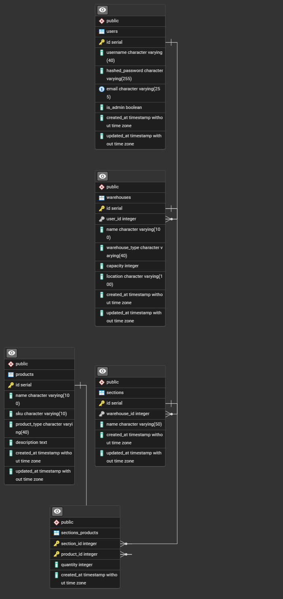

# 📦 Inventory Management System

A full-stack inventory management solution that allows administrators to manage warehouses, sections, products, and stored quantities across multiple locations.
The system ensures accurate tracking, prevents over-capacity errors, and provides clean REST APIs for external consumption.

##  🚀 Features

### Warehouse Management
- Create new warehouses with name, location, and max capacity.

- View all warehouses with real-time current load calculation.

- Update warehouse details (capacity, location, name, etc.).

- Delete warehouses safely (with validation).

- Automatic prevention of over-capacity stocking.

### Product Management
- Create, view, update, and delete product records.

- Automatic SKU generation (e.g., "PRD-ABC1234").

- Used across warehouse sections for inventory tracking.

### Section Management
- Create new warehouses with name, location, and max capacity.

- View all warehouses with real-time current load calculation.

- Update warehouse details (capacity, location, name, etc.).

- Delete warehouses safely (with validation).

- Automatic prevention of over-capacity stocking.

## 🧱 Tech Stack

### Backend
- Java 17+

- Spring Boot

- Spring Web

- Spring Data JPA

- Hibernate

- MySQL / PostgreSQL (any relational DB)

- Lombok (optional)

### Frontend
- React + Vite

- Material UI (MUI)

- Custom navigation + taskbar implemented.

## 🗂️Project Architecture
```src/
 ├── controllers/
 ├── services/
 ├── repositories/
 ├── models/
 │     ├── enums
 │     ├── Warehouse
 │     ├── Section
 │     ├── Product
 │     └── SectionProduct (junction)
 ├── dto/
 └── exception/
```

### Relationships
- Warehouse → Sections (1-to-many)
- Section → SectionProducts (1-to-many)
- Product → SectionProducts (1-to-many)
- SectionProduct holds: section, product, quantity.

## 📸 ERD (Entity Relationship Diagram)


## 📡 REST API Overview
### ✔ User Controller
**Simple lookup for admin/user records
GET /user/{id} → returns user info**

### ✔ Warehouse Controller
- GET /warehouse – list all warehouses

- GET /warehouse/{id} – get single warehouse

- POST /warehouse – create

- PUT /warehouse/{id} – update

- DELETE /warehouse/{id} – delete

### ✔ Section Controller
- GET /section/{id} – view section

- PUT /section/{sectionId}/products/{productId} – update quantity

### ✔ Product Controller
- GET /product – list all products

- GET /product/{id} – find by ID

- POST /product – create product

- PUT /product/{id} – update

- DELETE /product/{id} – delete

## ⚠️ Error Handling & Validation
**Warehouse Capacity Overflow**\
Attempting to add inventory beyond the warehouse’s **`maxCapacity`** will:
- Throw a custom exception
- Be returned as 400 Bad Request with a message header

**Duplicate Products in Section**\
Adding the same product twice updates quantity instead of duplicating data.

**General Exception Mapping**\
Controllers follow this structure:
- 400 for validation errors
- 404 for missing resources
- 500 for unexpected failures

## 🧠 Business Logic Highlights
**Current Warehouse Load** \
Calculated dynamically — not stored:
```
@JsonProperty("current_load")
public int getCurrentLoad() {
    int sum = 0;
    for (Section section : sections) {
        for (SectionProduct sp : section.getSectionProducts()) {
            sum += sp.getQuantity();
        }
    }
    return sum;
}
```
**Prevents Over-Stocking** \
Before updating a quantity:
- Calculate total load
- Verify it does not exceed warehouse capacity
- Reject the update if necessary

**SKU Auto-Generation Example** \
SKUs follow a **`"PRD-XXXXXXX"`** pattern using UUID substring.

### 🖥️ Frontend Overview
Features implemented:
- Global taskbar with React + MUI

- Warehouse cards with horizontal scrolling animation

- Search & filter for products

- Responsive layout

- Dynamic dashboard showing capacity usage

### ▶️ How to Run
**Backend**
```
bash

mvn spring-boot:run
```

**Make sure your database is configured in application.properties.

**Frontend**
```
bash

cd client
npm install
npm run dev
```
### 📌 Future Improvements
- Better role-based authentication

- Activity logging (audit trails)

- Low/incoming stock alerts

- Soft-deletion support
